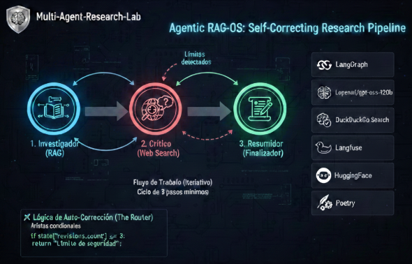
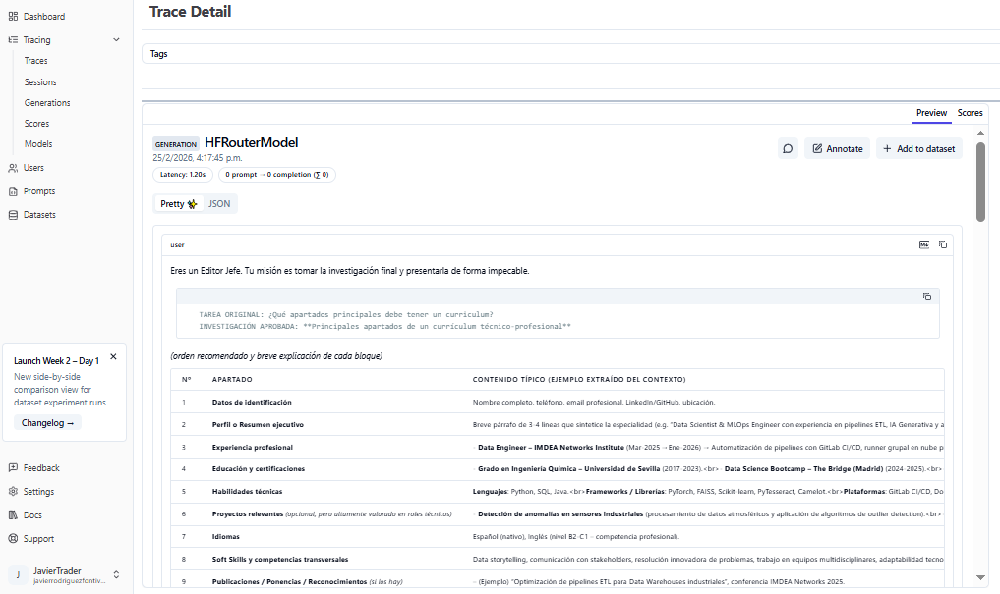
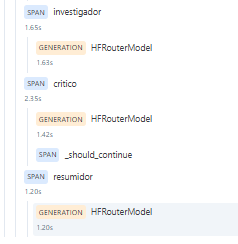
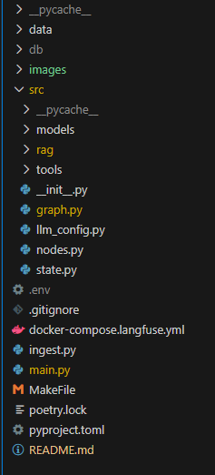
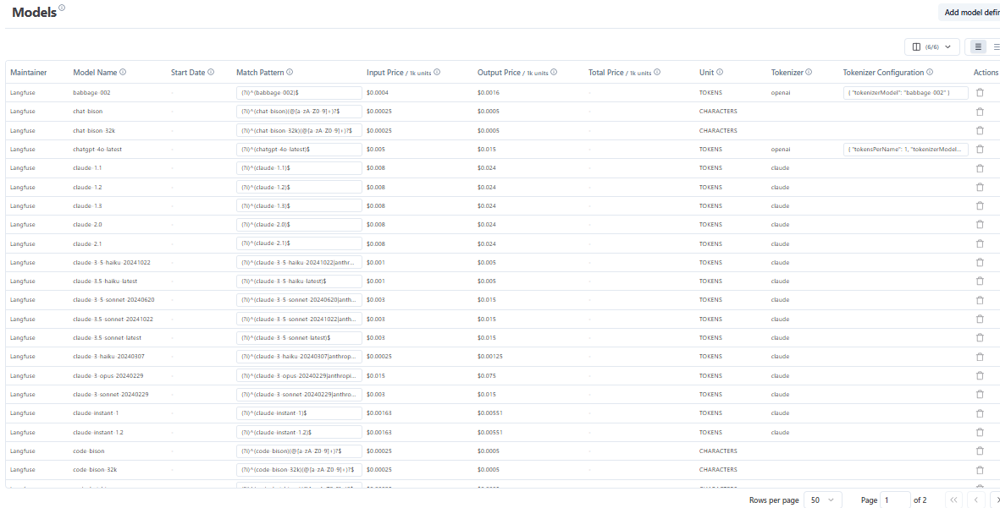

# 🛡️ Multi-Agent-Research-Lab  
## Agentic-RAG-OS: Self-Correcting Research Pipeline



Este proyecto implementa un sistema **multi-agente** capaz de realizar investigación técnica profunda, combinando **documentos locales (RAG)** con **búsquedas en tiempo real (Web Search)**, utilizando una arquitectura de **grafo cíclico con auto-corrección**.

---

# 🏗️ Arquitectura del Sistema

## Flujo de Trabajo (Iterativo)

A diferencia de los sistemas lineales, este laboratorio utiliza un **ciclo de 3 pasos mínimos** que se repiten hasta alcanzar la excelencia:

1. **Investigador (RAG)**  
   Extrae conocimiento de la base de datos vectorial local.

2. **Crítico (Web Search)**  
   Contrasta la información local con la red (**DuckDuckGo**) y evalúa si la respuesta es completa.

3. **Resumidor (Finalizador)**  
   Consolida el conocimiento verificado en un **informe ejecutivo**.




---

# 🛠️ Stack Tecnológico Actualizado

| Capa | Herramienta | Razón de elección |
|---|---|---|
| Orquestación | **LangGraph** | Gestión de estado y ciclos de revisión (loops/grafos). |
| Modelos (LLM) | **Lopenai/gpt-oss-120b** | Inferencia local privada y potente. |
| Buscador | **DuckDuckGo Search** | Búsqueda web anónima sin necesidad de API Keys complejas. |
| Observabilidad | **Langfuse** | Tracing completo de la "mente" del agente y sus iteraciones. |
| Gestor de Paquetes | **Poetry** | Gestión robusta de dependencias y entornos virtuales. |


---

# 🚀 Lógica de Auto-Corrección (The Router)

El sistema utiliza **aristas condicionales** para decidir si la investigación debe continuar.  
Si el **Crítico detecta lagunas**, el flujo vuelve al **Investigador** con instrucciones específicas de mejora.

```python
# Ejemplo de la lógica de control en el grafo
if state["revisions_count"] >= 3:
    return "finalizer"  # Límite de seguridad para evitar costes/tiempo infinito
```



# 💻 Instalación


```# 1. Clonar y entrar
git clone https://github.com/tu-usuario/multi-agent-research-lab.git
cd multi-agent-research-lab

# 2. Instalar con Poetry
poetry install

# 3. Configurar entorno (.env)
LANGFUSE_PASS=
LANGFUSE_USER=
LANGFUSE_MAIL=

LANGFUSE_PUBLIC_KEY=
LANGFUSE_SECRET_KEY=
LANGFUSE_HOST=""

HF_TOKEN = ""

# 4. Ejecutar el laboratorio
poetry run python -m main
```

## Estructura del repositorio:




## Extra: Langfuse te ayuda a estimar el gasto de tus agentes

